# jupyter_notebooks_gma

# Dashboards

En este proyecto se elaboran los dashboards de:
- Ingresos salidas de almacen
1. Ingresos
2. *Salidas*


A continuación unos cuantos ejemplos de diagramas:
    
    Mermaid es un lenguaje de marcado que te permite crear diagramas y visualizaciones dinámicas y fáciles de mantener directamente en Markdown. Es ampliamente utilizado debido a su simplicidad y versatilidad, y es compatible con varias herramientas y plataformas, incluyendo VSCode, GitHub, GitLab y más.
    
---

## 1. **Diagramas de Flujo**

Los diagramas de flujo se utilizan para representar procesos, flujos de trabajo o algoritmos de manera visual.

### **Sintaxis Básica**

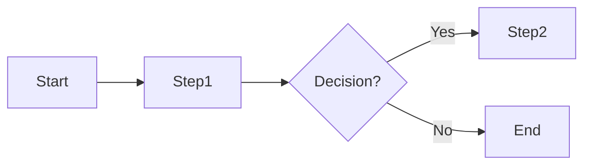

- `graph`: Indica que estás creando un diagrama de flujo.
- `[LR/TD/RL/BT]`: Dirección del flujo.
    - `LR`: Izquierda a Derecha
    - `TD`: Arriba a Abajo (por defecto)
    - `RL`: Derecha a Izquierda
    - `BT`: Abajo a Arriba
- `->`: Flecha sólida
- `- text -->`: Flecha con texto
- `--`: Línea punteada
- `node1((Circle))`: Nodo circular
- `node2[Rectangle]`: Nodo rectangular
- `node3{Rhombus}`: Nodo rombo (decisión)
- `node4>Asimétrico]`: Nodo asimétrico
- `node5[[Subrutina]]`: Nodo subrutina

### **Ejemplo**

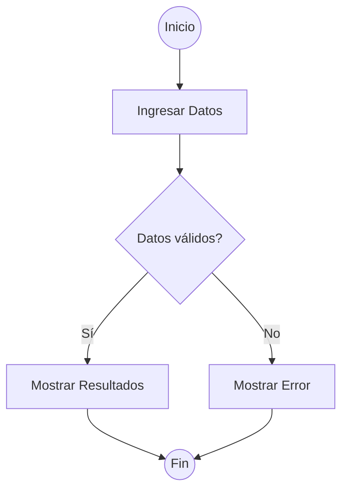

**Visualización:**


---

## 2. **Diagramas de Secuencia**

Los diagramas de secuencia representan interacciones entre diferentes objetos o componentes en un sistema a lo largo del tiempo.

### **Sintaxis Básica**

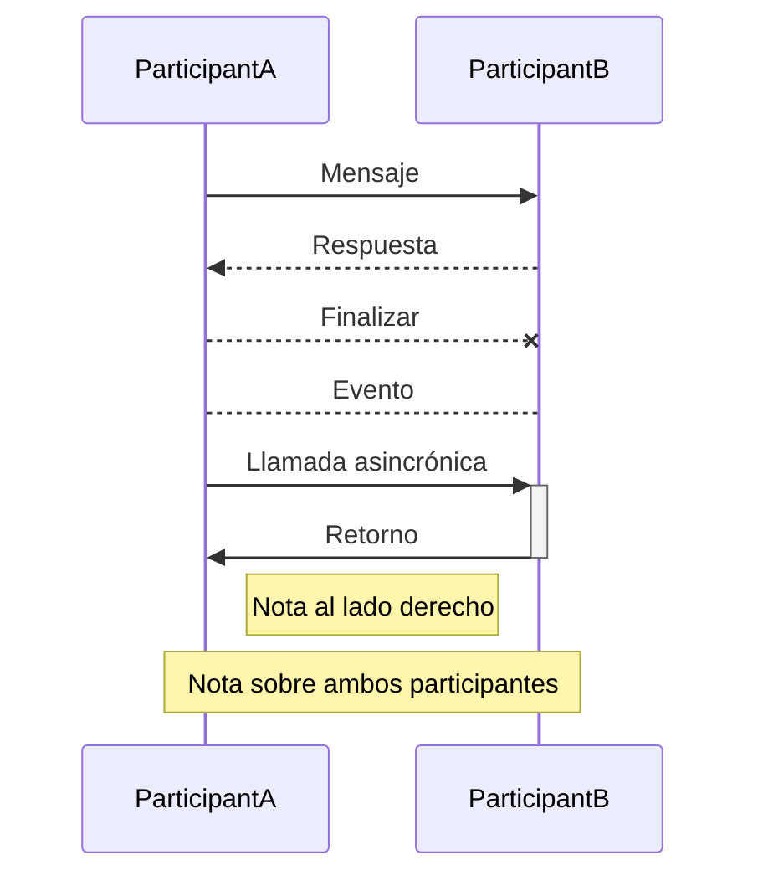

- `>>`: Flecha sólida (llamada)
- `->>`: Flecha punteada (retorno)
- `-x`: Flecha de destrucción
- `-o`: Flecha de evento
- `>>+`: Llamada asincrónica iniciada
- `>>-`: Llamada asincrónica finalizada

### **Ejemplo**

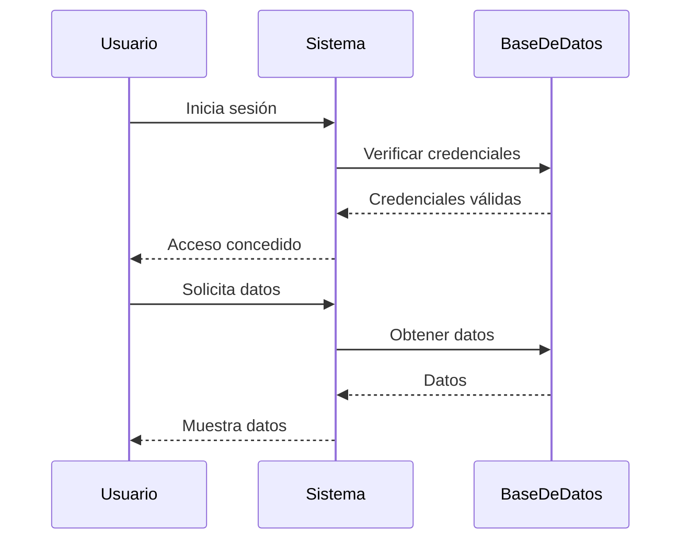

**Visualización:**


---

## 3. **Diagramas de Clase**

Los diagramas de clase se utilizan para representar la estructura de clases en programación orientada a objetos, mostrando clases, interfaces y las relaciones entre ellas.

### **Sintaxis Básica**

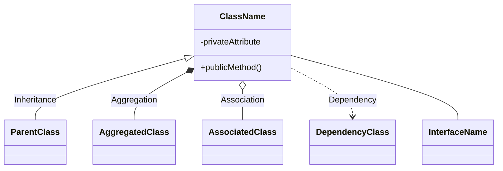

- `<|--`: Herencia
- `--`: Agregación
- `o--`: Asociación
- `..>`: Dependencia
- `-`: Realización o implementación
- `+`: Público
- ``: Privado
- `#`: Protegido

### **Ejemplo**

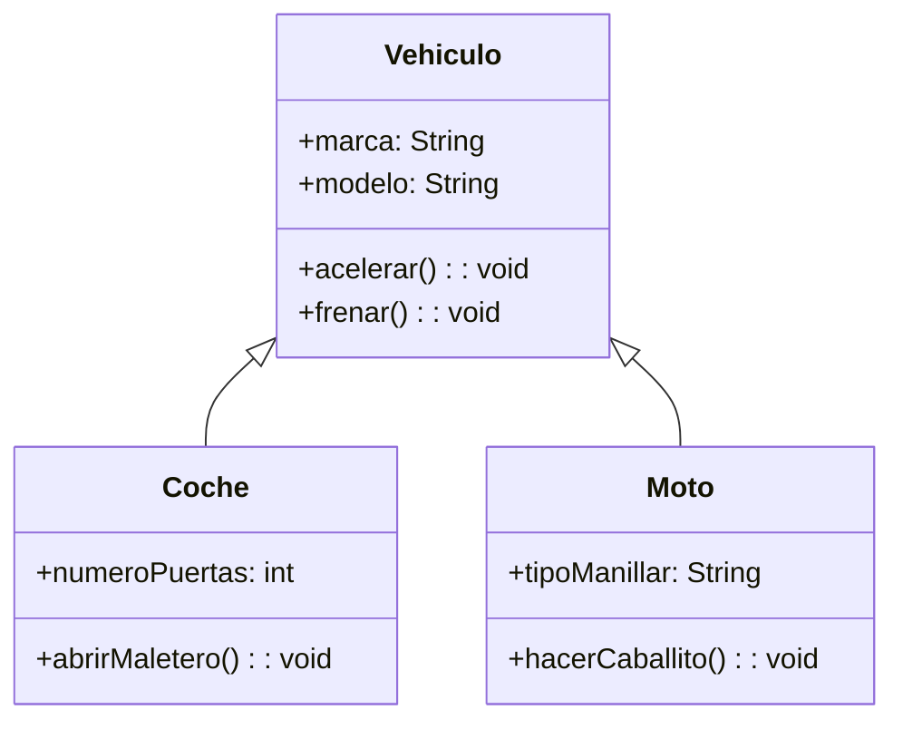

**Visualización:**


---

## 4. **Diagramas de Estado**

Los diagramas de estado muestran los diferentes estados por los que pasa un objeto o sistema y las transiciones entre esos estados.

### **Sintaxis Básica**

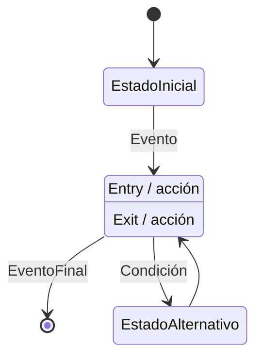

- `[ * ]`: Estado inicial o final
- `->`: Transición de estado
- `Estado : Entry / acción`: Acción al entrar en el estado
- `Estado : Exit / acción`: Acción al salir del estado

### **Ejemplo**

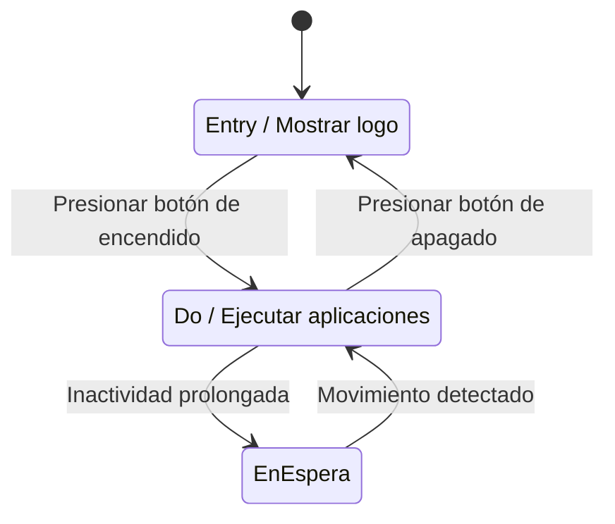

**Visualización:**


---

## 5. **Diagramas de Entidad-Relación (ER)**

Los diagramas ER se utilizan para modelar bases de datos mostrando entidades y las relaciones entre ellas.

### **Sintaxis Básica**

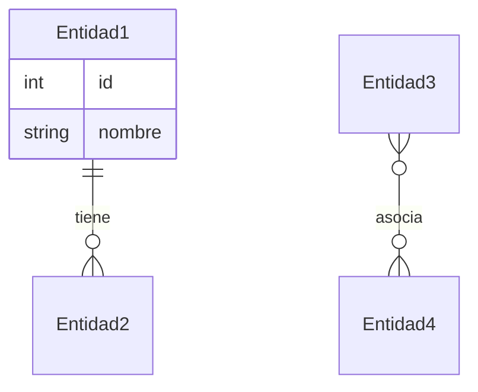

- `||`: Relación uno a uno
- `}|`: Relación uno a muchos
- `}|{`: Relación muchos a muchos
- `o|`: Relación opcional uno
- `o{`: Relación opcional muchos

### **Ejemplo**

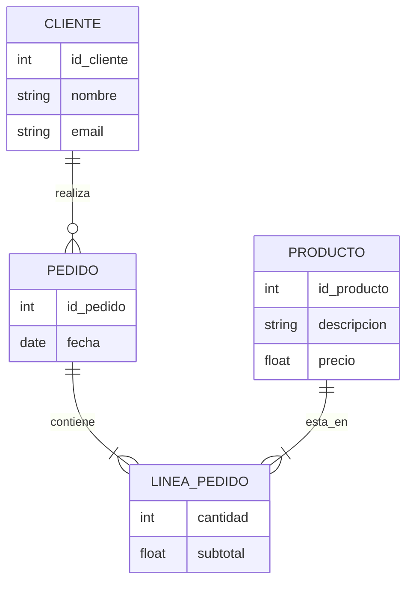

**Visualización:**


---

## 6. **Diagramas de Gantt**

Los diagramas de Gantt se utilizan para representar cronogramas de proyectos, mostrando tareas, duraciones y dependencias.

### **Sintaxis Básica**

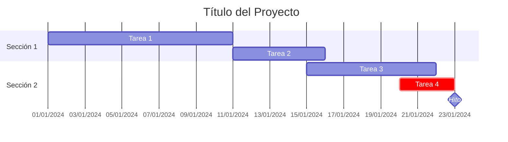

- `title`: Título del diagrama
- `dateFormat`: Formato de fecha
- `axisFormat`: Formato del eje de tiempo
- `section`: Agrupa tareas bajo una categoría
- `:crit`: Marca la tarea como crítica
- `:milestone`: Marca un hito
- `:active`: Marca la tarea como activa
- `after a1`: Comienza después de la tarea con ID `a1`

### **Ejemplo**

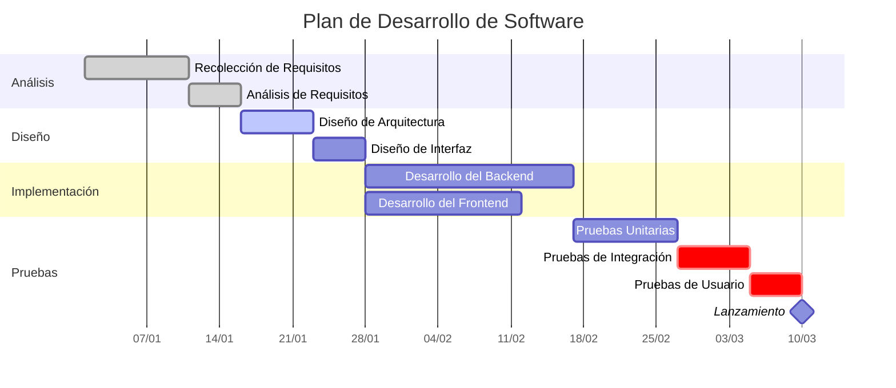

**Visualización:**


---

## 7. **Diagramas de Torta (Pie)**

Los diagramas de torta se utilizan para representar proporciones y porcentajes de manera visual.

### **Sintaxis Básica**


- `pie [title]`: Define un diagrama de torta con un título opcional.

### **Ejemplo**

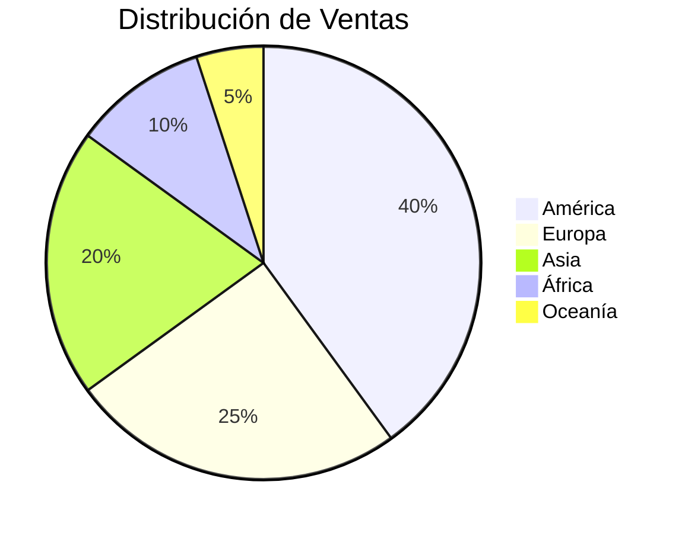

**Visualización:**

```mermaid
pie title Distribución de Ventas por Región
    "América" : 40
    "Europa" : 25
    "Asia" : 20
    "África" : 10
    "Oceanía" : 5

```

---

## 8. **Mapas Mentales**

Los mapas mentales se utilizan para representar ideas y conceptos de manera jerárquica y visual.

### **Sintaxis Básica**

```mermaid
mindmap
    root(Raíz)
        Subtema1
            Idea1
            Idea2
        Subtema2
            Idea3
            Idea4

```

- `mindmap`: Define un mapa mental.
- `root(Raíz)`: Nodo raíz del mapa mental.
- La indentación define la jerarquía.

### **Ejemplo**

```mermaid
mindmap
    root(Plan de Proyecto)
        Definición
            Objetivos
            Alcance
        Planificación
            Recursos
            Cronograma
        Ejecución
            Desarrollo
            Pruebas
        Cierre
            Entrega
            Retroalimentación

```

**Visualización:**

```mermaid
mindmap
    root(Plan de Proyecto)
        Definición
            Objetivos
            Alcance
        Planificación
            Recursos
            Cronograma
        Ejecución
            Desarrollo
            Pruebas
        Cierre
            Entrega
            Retroalimentación

```

---

## 9. **Diagramas de Viaje del Usuario (User Journey)**

Los diagramas de viaje del usuario representan las interacciones y emociones de un usuario a lo largo de un proceso o experiencia.

### **Sintaxis Básica**

```mermaid
journey
    title Título del Viaje
    section Sección 1
        Paso 1 : etapa1
        Paso 2 : etapa2
    section Sección 2
        Paso 3 : etapa3
        Paso 4 : etapa4

```

- `journey`: Define un diagrama de viaje del usuario.
- `title`: Título del diagrama.
- `section`: Agrupa pasos bajo una categoría.
- `etapa`: Nivel de satisfacción/emoción (puede ser numérico o textual).

### **Ejemplo**

```mermaid
journey
    title Compra en Línea
    section Navegación
        Buscar Producto : 5
        Ver Detalles : 4
    section Compra
        Agregar al Carrito : 4
        Realizar Pago : 2
    section Post-compra
        Recepción del Producto : 5
        Dejar Reseña : 4

```

**Visualización:**

```mermaid
journey
    title Compra en Línea
    section Navegación
        Buscar Producto : 5
        Ver Detalles : 4
    section Compra
        Agregar al Carrito : 4
        Realizar Pago : 2
    section Post-compra
        Recepción del Producto : 5
        Dejar Reseña : 4

```

---

## 10. **Estilos y Temas**

Mermaid permite personalizar el estilo y apariencia de los diagramas mediante clases y configuraciones globales.

### **Aplicar Estilos a Nodos**

```mermaid
graph TD
    A[Inicio] --> B[Proceso]
    B --> C[Fin]

    classDef clasePersonalizada fill:#f9f,stroke:#333,stroke-width:4px;
    class B clasePersonalizada;

```

- `classDef`: Define una clase de estilo personalizada.
- `class`: Asigna la clase a nodos específicos.

**Ejemplo con Estilos:**

```mermaid
graph TD
    A[Inicio] --> B[Proceso]
    B --> C[Fin]

    classDef importante fill:#ffcccc,stroke:#ff0000,stroke-width:2px;
    class B importante;

```

**Visualización:**

```mermaid
graph TD
    A[Inicio] --> B[Proceso]
    B --> C[Fin]

    classDef importante fill:#ffcccc,stroke:#ff0000,stroke-width:2px;
    class B importante;

```

### **Temas Globales**

Puedes cambiar el tema global de los diagramas configurando la variable `theme`.

```mermaid
%%{init: {'theme': 'dark'}}%%
graph TD
    A --> B
    B --> C

```

- Temas disponibles: `default`, `forest`, `dark`, `neutral`, etc.

**Ejemplo con Tema Oscuro:**

```mermaid
%%{init: {'theme': 'dark'}}%%
graph TD
    A --> B
    B --> C

```

**Visualización:**

```mermaid
%%{init: {'theme': 'dark'}}%%
graph TD
    A --> B
    B --> C

```
