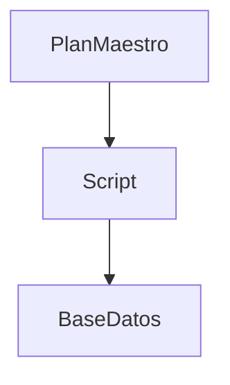
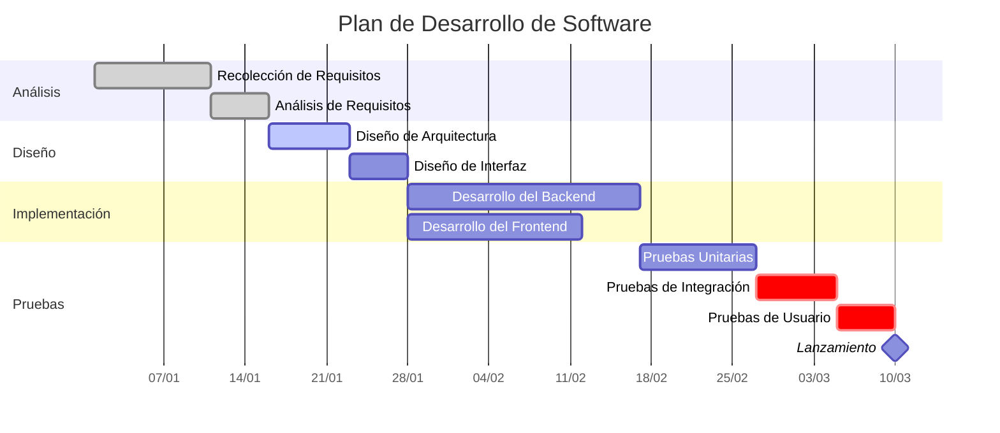
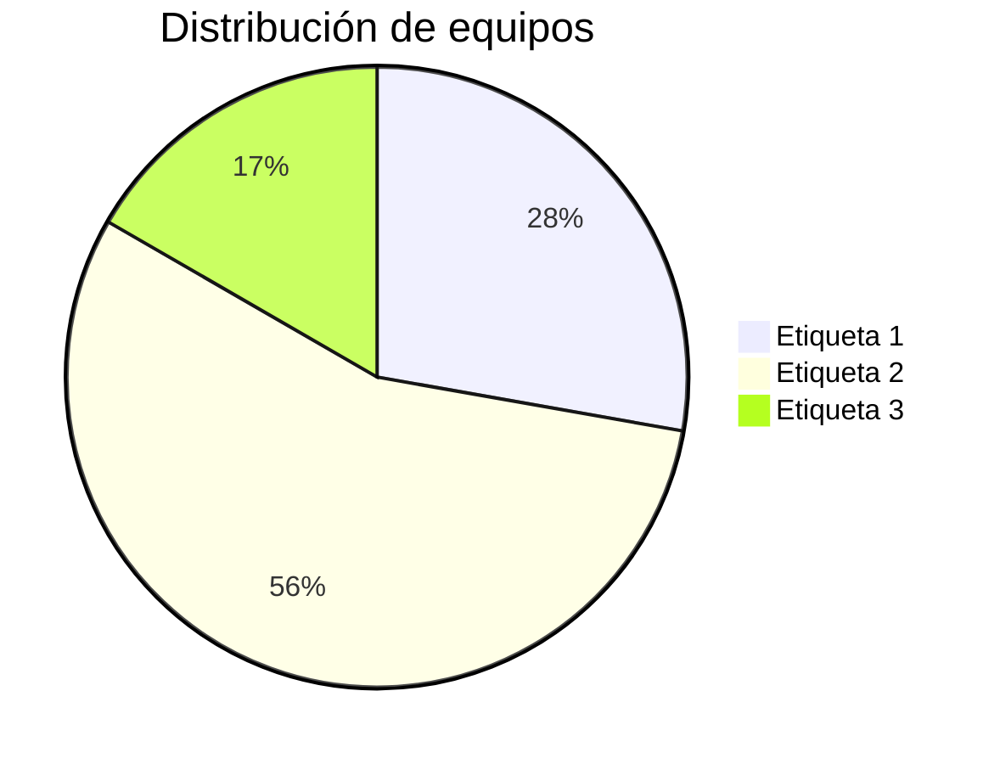

# Script de python para la migracion
Se desarrolla un script en python para la imporación de datos desde la taxonomia y el plan de Mantenimiento 

___

### 3. **Visualizar el Diagrama**:
Para ver el diagrama en VSCode:

- Guarda tu archivo Markdown con el código Mermaid.
- Abre la vista previa del archivo Markdown. Puedes hacerlo de varias maneras:
  - Haz clic derecho en el archivo y selecciona **"Open Preview"**.
  - O utiliza el atajo de teclado `Ctrl+Shift+V` (o `Cmd+Shift+V` en Mac).
  - O abre la vista dividida con `Ctrl+K V` (o `Cmd+K V` en Mac) para ver el código y la vista previa al mismo tiempo.
  
El diagrama Mermaid debería renderizarse en la vista previa del Markdown.

### 4. **Configuración Adicional (Opcional)**:
Si quieres personalizar la configuración de Mermaid, puedes hacerlo en la configuración de usuario o de espacio de trabajo en VSCode. Busca "Mermaid" en la configuración para ajustar opciones como el tema del diagrama, la fuente, entre otros.

¡Y eso es todo! Ahora deberías poder escribir y visualizar diagramas Mermaid en tus archivos Markdown directamente en VSCode.
